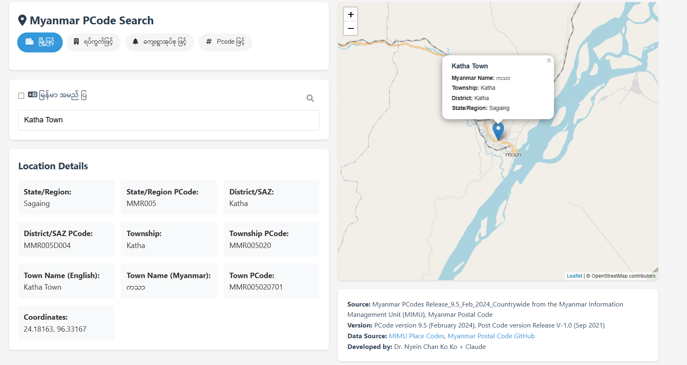

# Myanmar PCode Search / မြန်မာ PCODE ရှာဖွေရေးစနစ်

A high-performance web application for searching Myanmar locations using PCodes (Place Codes) with interactive map interface, coordinate search, and batch processing capabilities.

မြန်မာနိုင်ငံရှိ နေရာဒေသများကို PCODE စနစ်ဖြင့် လွယ်ကူစွာ ရှာဖွေနိုင်သော မြန်နှုန်းမြင့် ဝဘ်အပ်ပလီကေးရှင်းတစ်ခု ဖြစ်ပါသည်။ အသုံးပြုသူများအနေဖြင့် မိမိရှာဖွေလိုသော နေရာဒေသများကို ရိုက်ရှာ၊ ကိုဩဒိနိတ်ဖြင့်ရှာ၊ landmark များဖြင့်ရှာပြီး PCode နှင့် Postal Code တို့ကို ကြည့်ရှုနိုင်သည်။



## Version History / ဗားရှင်းမှတ်တမ်း

**Version 1.4 (Current - Performance Optimized)**
- 🚀 **Major Performance Improvements**: 50-100x faster search performance using spatial indexing
- 🔍 **Enhanced Coordinate Search**: Optimized latitude/longitude search with bounding box filtering
- 📍 **Smart Landmark Search**: Find locations near temples, pagodas, businesses, and landmarks using OSM data
- 🔄 **Advanced Batch Processing**: Parallel processing for CSV coordinate uploads (up to 1000 coordinates)
- 📊 **Performance Monitoring**: Real-time search performance analytics and optimization
- 🎯 **Intelligent Caching**: Distance calculation caching for repeated searches
- 🔧 **Fallback System**: Automatic fallback to ensure reliability

**Version 1.3 (June 2 2025)**
- Added search by location (using OSM query)
- Fixed missing postal code for village and ward
- Support Google Maps link in coordinate search

**Version 1.2 (June 1 2025)**
- Added search by lat/long coordinates
- Added upload lat/long CSV file and search pcode region, district, township, town and villages
- Improved UI and refactored code

**Version 1.1 (Feb 14 2025)**
- Added PCode version 9.6
- Added village search

**Version 1.0**
- Initial release

## Features / လုပ်ဆောင်ချက်များ

### 🔍 **Search Methods / ရှာဖွေမှုနည်းလမ်းများ**
- **Text Search**: Search by town, ward, village tract, and village names (မြို့၊ ရပ်ကွက်၊ ကျေးရွာအုပ်စု၊ ရွာ)
- **PCode Search**: Search using administrative place codes (စီမံကိန်းခွဲခြားကုဒ်ဖြင့်ရှာခြင်း)
- **Coordinate Search**: Find locations by latitude/longitude coordinates (ကိုဩဒိနိတ်ဖြင့်ရှာခြင်း)
- **Landmark Search**: Search near temples, pagodas, businesses, and points of interest (ဘုရားကျောင်း၊ လုပ်ငန်းများအနီးရှာခြင်း)
- **Google Maps Integration**: Paste Google Maps URLs for coordinate extraction

### 📊 **Batch Processing / အစုအဖွဲ့လိုက်ပြုလုပ်ခြင်း**
- **CSV Upload**: Process up to 1000 coordinates simultaneously
- **Parallel Processing**: Fast batch coordinate search with progress tracking
- **Export Results**: Download results as CSV with full administrative hierarchy
- **Error Handling**: Comprehensive validation and error reporting

### 🗺️ **Interactive Features / အပြန်အလှန်လုပ်ဆောင်နိုင်သောအင်္ဂါရပ်များ**
- **Interactive Map**: Leaflet-based map with location markers and zoom
- **Bilingual Support**: English and Myanmar language display
- **Real-time Suggestions**: Autocomplete and suggestion system
- **Performance Metrics**: Search speed and optimization statistics

### ⚡ **Performance Features / စွမ်းဆောင်ရည်အင်္ဂါရပ်များ**
- **Spatial Indexing**: Grid-based location indexing for O(1) lookups
- **Distance Caching**: Smart caching for repeated distance calculations
- **Optimized Algorithms**: Bounding box filtering before expensive calculations
- **Memory Management**: Efficient data loading and cache size limits

## Technical Documentation / နည်းပညာဆိုင်ရာမှတ်တမ်း

For detailed information about algorithms, performance optimizations, and technical implementation:
👉 **[View Technical Documentation](technical.html)**

## Data Sources / အချက်အလက်ရင်းမြစ်များ

### Administrative Data / စီမံကိန်းဆိုင်ရာအချက်အလက်များ
- **MIMU**: Myanmar PCodes Release_9.6_Feb_2025_Countrywide from Myanmar Information Management Unit
- **Myanmar Post**: Postal codes Version V-1.0 (September 2021)

### Geographic Data / ပထဝီဝင်ဆိုင်ရာအချက်အလက်များ
- **OpenStreetMap (OSM)**: Location geocoding, landmark data, and geographic information
  - Nominatim geocoding service for landmark and location search
  - Global collaborative mapping data under ODbL license
  - Special thanks to OSM contributors in Myanmar

## Usage Examples / အသုံးပြုနမူနာများ

### Coordinate Search Examples:
```
16.8661, 96.1951          # Yangon City Hall
21.9588, 96.0891          # Mandalay Palace
16.7967, 96.1500          # Shwedagon Pagoda area
```

### Landmark Search Examples:
```
Shwedagon Pagoda          # Famous pagoda in Yangon
Mandalay Palace           # Historical site
Yangon Central Railway    # Transportation hub
Bogyoke Market           # Shopping area
```

### CSV Batch Upload Format:
```csv
id,latitude,longitude
1,16.8661,96.1951
2,21.9588,96.0891
3,16.7967,96.1500
```


## Contributing / ပံ့ပိုးကူညီခြင်း

We welcome contributions to improve Myanmar PCode Search:

1. **Data Updates**: Help update location data and corrections
2. **Performance**: Contribute optimization improvements
3. **Features**: Add new search capabilities
4. **Documentation**: Improve guides and translations
5. **Testing**: Report bugs and test new features

## License and Credits / လိုင်စင်နှင့်ကျေးဇူးတင်ခြင်း

### Data Credits:
- **MIMU**: Administrative boundary and PCode data
- **Myanmar Post**: Postal code information  
- **OpenStreetMap Contributors**: Geographic and landmark data under Open Database License (ODbL)

### Special Thanks:
- Myanmar Information Management Unit (MIMU) for comprehensive PCode data
- OpenStreetMap community and Myanmar OSM contributors
- Myanmar Post for postal code standardization

## Links / လင့်များ

- **[MIMU Place Codes](https://themimu.info/place-codes)** - Official PCode data source
- **[Myanmar Postal Code GitHub](https://github.com/MyanmarPost/MyanmarPostalCode)** - Postal code repository
- **[OpenStreetMap Myanmar](https://openstreetmap.org/relation/50371)** - OSM data for Myanmar
- **[Technical Documentation](technical.html)** - Detailed implementation guide

---

**Developed by Medaius** | **Version 1.4** | **Performance Optimized** ⚡
