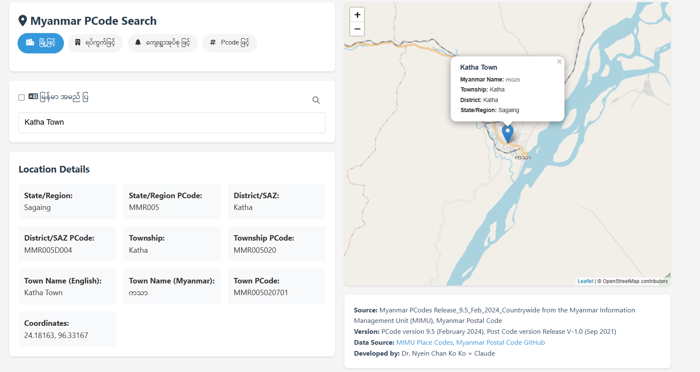

# Myanmar PCode Search / မြန်မာ ပုဒ်ကုဒ် ရှာဖွေရေးစနစ်

A web application for searching Myanmar locations using PCodes (Place Codes) with an interactive map interface.

မြန်မာနိုင်ငံရှိ နေရာဒေသများကို PCODE စနစ်ဖြင့် လွယ်ကူစွာ ရှာဖွေနိုင်သော ဝဘ်အပ်ပလီကေးရှင်းတစ်ခု ဖြစ်ပါသည်။ အသုံးပြုသူများအနေဖြင့် မိမိရှာဖွေလိုသော နေရာဒေသများကို ရိုက်ရှာပြီး PCode နှင့် Postal Code တို့ကို ကြည့်ရှုနိုင်သည်။

## Features / လုပ်ဆောင်ချက်များ

- Search by towns, wards, village tracts, and PCodes
- Interactive map interface with location markers

## Data Sources / အချက်အလက်ရင်းမြစ်များ

- MIMU မှ ထုတ်ပြန်သော Myanmar PCodes Release_9.5_Feb_2024_Countrywide
- မြန်မာ့စာတိုက်လုပ်ငန်း၏ စာတိုက်သင်္ကေတများ Version V-1.0 (September 2021)

## Links / လင့်များ

- [MIMU Place Codes](https://themimu.info/place-codes)
- [Myanmar Postal Code GitHub](https://github.com/MyanmarPost/MyanmarPostalCode)
