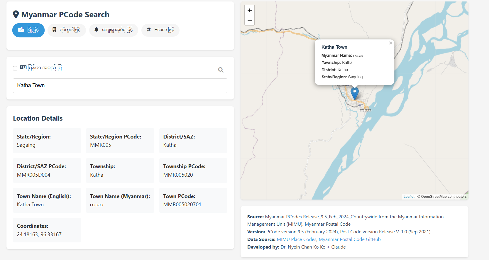

# Myanmar PCode Search / မြန်မာ PCode ရှာဖွေရေးစနစ်

> **English:** A fast, simple, and free tool to search every place in Myanmar — towns, wards, village tracts, and villages. Find official MIMU Place Codes (PCode), postal codes, administrative hierarchies, and map locations. Works completely offline on your phone or computer.
> 
> **မြန်မာ:** မြန်မာနိုင်ငံတစ်ဝန်းရှိ တိုင်းဒေသကြီး/ပြည်နယ်၊ ခရိုင်၊ မြို့နယ်၊ မြို့၊ ရပ်ကွက်၊ ကျေးရွာအုပ်စုနှင့် ကျေးရွာများကို လွယ်ကူလျင်မြန်စွာ ရှာဖွေနိုင်သော အခမဲ့ ဝဘ်ဆိုက်ဖြစ်ပါသည်။ တရားဝင် MIMU PCode များ၊ စာတိုက်သင်္ကေတများ၊ အုပ်ချုပ်မှုအဆင့်ဆင့်နှင့် မြေပုံတည်နေရာများကို အင်တာနက်လိုင်းမရှိဘဲ (Offline) လည်း အလွယ်တကူ ရှာဖွေအသုံးပြုနိုင်ပါသည်။



---

## 📖 Table of Contents / မာတိကာ
- [English Guide for Users](#-for-everyday-users)
  - [What is a PCode?](#what-is-a-pcode)
  - [What Can You Do with This App?](#what-can-you-do-with-this-app)
- [မြန်မာဘာသာ အသုံးပြုနည်းလမ်းညွှန်](#-သာမန်အသုံးပြုသူများအတွက်-လမ်းညွှန်)
  - [PCode ဆိုတာဘာလဲ?](#pcode-ဆိုတာဘာလဲ)
  - [ဤစနစ်ဖြင့် ဘာတွေလုပ်ဆောင်နိုင်သလဲ?](#ဤစနစ်ဖြင့်-ဘာတွေလုပ်ဆောင်နိုင်သလဲ)
- [💻 For Developers & Technical Users](#-for-developers--technical-users)
  - [Getting Started](#getting-started)
  - [Project Layout](#project-layout)
  - [REST API](#rest-api)
  - [Data Sources & Acknowledgements](#data-sources--အချက်အလက်ရင်းမြစ်များ)
  - [Contributing](#contributing--ပံ့ပိုးကူညီခြင်း)

---

## 🌟 For Everyday Users

### What is a PCode?
A **Place Code (PCode)** is a unique official ID code given to every geographic location in Myanmar by the **MIMU** (Myanmar Information Management Unit). Just like an ID card number for people, a PCode uniquely identifies a specific state, district, township, town, ward, village tract, or village so there is no confusion between places that share the same name.

### What Can You Do with This App?

1. **🔍 Search by Place Name (English or Myanmar)**
   - Type any town, ward, village tract, or village name in either Myanmar Unicode or English.
   - Example: Type `Yangon` or `ရန်ကုန်`, `Bago` or `ပဲခူး`.
   - Use the category tabs (`Towns`, `Wards`, `Village Tracts`, `Villages`) to narrow down results.

2. **📮 Search by Postal Code**
   - Switch to the **Postal Code** tab.
   - Type a full 7-digit postal code (e.g., `1118001`) to see which ward or village tract it belongs to.
   - Or type the first 4 digits (e.g., `1118`) to see all postal areas across that township.

3. **🗺️ Click-on-Map & GPS Coordinate Search**
   - Click anywhere on the interactive map to automatically find the nearest village, ward, or town and see how many kilometers away it is.
   - Paste GPS coordinates (like `16.8661, 96.1951`) or paste a **Google Maps link** directly into the search bar.

4. **🏛️ Search by Landmark**
   - Type famous locations like `Shwedagon Pagoda` or `Junction City` to quickly zoom in and find the local administrative area.

5. **📶 Offline Mode (No Internet Needed!)**
   - Heading out to the field or an area with poor connectivity?
   - Visit the **Offline DB** page while you have internet and click download (~3.2 MB).
   - Once saved, you can search all places, view the map, and look up codes with zero mobile data or Wi-Fi.

6. **📁 Batch CSV Matching (For Surveys & Data Entry)**
   - Have a spreadsheet of GPS coordinates from field surveys or medical trips?
   - Upload a CSV file with up to 2,000 coordinates to the **Batch CSV** page.
   - The app will automatically match each point to the closest village/town and PCode, and let you export the enriched results as a CSV file.

---

## 🇲🇲 သာမန်အသုံးပြုသူများအတွက် လမ်းညွှန်

### PCode ဆိုတာဘာလဲ?
**PCode (Place Code)** ဆိုသည်မှာ မြန်မာနိုင်ငံရှိ ပြည်နယ်/တိုင်းဒေသကြီး၊ ခရိုင်၊ မြို့နယ်၊ မြို့၊ ရပ်ကွက်၊ ကျေးရွာအုပ်စုနှင့် ကျေးရွာတစ်ခုချင်းစီအတွက် **MIMU** (မြန်မာ့သတင်းအချက်အလက်စီမံခန့်ခွဲမှုဌာန) မှ တရားဝင် သတ်မှတ်ပေးထားသော သီးသန့် အသိအမှတ်ပြုကုဒ်နံပါတ် ဖြစ်ပါသည်။ လူတစ်ဦးချင်းစီတွင် မှတ်ပုံတင်နံပါတ်ရှိသကဲ့သို့ အမည်တူနေသော ရွာများ၊ မြို့များကို မှားယွင်းမှုမရှိစေရန် တိကျစွာ ခွဲခြားသတ်မှတ်ပေးနိုင်သော စနစ်ဖြစ်ပါသည်။

### ဤစနစ်ဖြင့် ဘာတွေလုပ်ဆောင်နိုင်သလဲ?

1. **🔍 နေရာအမည်ဖြင့် ရှာဖွေခြင်း (မြန်မာစာ သို့မဟုတ် အင်္ဂလိပ်စာ)**
   - မြို့၊ ရပ်ကွက်၊ ကျေးရွာအုပ်စု သို့မဟုတ် ကျေးရွာအမည်များကို မြန်မာယူနီကုဒ်ဖြင့်ဖြစ်စေ၊ အင်္ဂလိပ်စာဖြင့်ဖြစ်စေ အလွယ်တကူ ရိုက်ထည့်ရှာဖွေနိုင်ပါသည်။
   - ဥပမာ - `ရန်ကုန်` သို့မဟုတ် `Yangon`၊ `ဓနုံးချောင်း` သို့မဟုတ် `Da None Chaung`။
   - အပေါ်ရှိ ခလုတ်များ (`မြို့`၊ `ရပ်ကွက်`၊ `ကျေးရွာအုပ်စု`၊ `ကျေးရွာ`) ကို နှိပ်၍ သီးသန့်စစ်ထုတ်ပြီး ရှာဖွေနိုင်ပါသည်။

2. **📮 စာတိုက်သင်္ကေတ (Postal Code) ဖြင့် ရှာဖွေခြင်း**
   - **စာတိုက်သင်္ကေတ** ခလုတ်ကို နှိပ်ပြီး ဂဏန်း ၇ လုံးပါ စာတိုက်ကုဒ် (ဥပမာ - `1118001`) ရိုက်ထည့်ပါက သက်ဆိုင်ရာ ရပ်ကွက်/ကျေးရွာအုပ်စုနှင့် PCode များကို ဖော်ပြပေးပါသည်။
   - မြို့နယ်အဆင့် စာတိုက်သင်္ကေတ (ဥပမာ - `1118`) ကဲ့သို့ ရှေ့ဂဏန်း ၄ လုံး ရိုက်ထည့်ပါကလည်း မြို့နယ်တစ်ခုလုံးရှိ စာတိုက်နယ်မြေများကို ကြည့်ရှုနိုင်ပါသည်။

3. **🗺️ မြေပုံပေါ်နှိပ်၍ရှာခြင်း နှင့် GPS Coordinates ဖြင့် ရှာဖွေခြင်း**
   - မြေပုံပေါ်တွင် မိမိသိလိုသောနေရာကို နှိပ်လိုက်ရုံဖြင့် အနီးဆုံးရှိ ကျေးရွာ၊ ရပ်ကွက်၊ မြို့နှင့် မည်မျှကီလိုမီတာ (km) ကွာဝေးသည်ကို ချက်ချင်း တွက်ချက်ပြသပေးပါသည်။
   - GPS ဂဏန်းများ (ဥပမာ - `16.8661, 96.1951`) သို့မဟုတ် **Google Maps Link** များကို Search Bar ထဲသို့ ကူးထည့်၍လည်း ရှာဖွေနိုင်ပါသည်။

4. **🏛️ ထင်ရှားသောနေရာများ (Landmarks) ဖြင့် ရှာဖွေခြင်း**
   - `ရွှေတိဂုံဘုရား`၊ `Junction City` စသည့် ထင်ရှားသောနေရာ အမည်များကို ရိုက်ထည့်၍လည်း အနီးဆုံးဒေသ အချက်အလက်များကို ရှာဖွေနိုင်ပါသည်။

5. **📶 အင်တာနက်မရှိဘဲ အသုံးပြုနိုင်ခြင်း (Offline Mode)**
   - ဖုန်းလိုင်း သို့မဟုတ် အင်တာနက် မကောင်းသော နယ်မြေဒေသများသို့ ကွင်းဆင်းသွားရောက်မည်ဆိုပါက **အော့ဖ်လိုင်း DB** စာမျက်နှာတွင် ဒေတာဖိုင် (~3.2 MB) ကို ကြိုတင်ဒေါင်းလုပ်ဆွဲထားနိုင်ပါသည်။
   - ဒေါင်းလုပ်ဆွဲပြီးပါက ဖုန်း သို့မဟုတ် ကွန်ပျူတာတွင် အင်တာနက်လုံးဝဖွင့်စရာမလိုဘဲ နေရာပေါင်း ၈၀,၀၀၀ ကျော်ကို အချိန်မရွေး ရှာဖွေအသုံးပြုနိုင်ပါသည်။

6. **📁 အစုလိုက် CSV တွဲစပ်ခြင်း (Batch CSV)**
   - ကွင်းဆင်းစစ်တမ်း သို့မဟုတ် ကျန်းမာရေး/လူမှုရေးလုပ်ငန်းများမှ ရရှိလာသော GPS Coordinates များကို Excel/CSV ဖိုင်အလိုက် တစ်ပြိုင်နက် PCode တွဲစပ်လိုပါက အသုံးပြုနိုင်ပါသည်။
   - အချက်အလက်ပေါင်း ၂,၀၀၀ အထိပါဝင်သော CSV ဖိုင်ကို ထည့်သွင်းလိုက်ရုံဖြင့် စနစ်က အနီးဆုံးကျေးရွာ၊ မြို့နယ်၊ PCode များကို အလိုအလျောက် ဖြည့်စွက်ပေးပြီး CSV ပြန်လည်ဒေါင်းလုပ် ထုတ်ယူနိုင်ပါသည်။

---

## 💻 For Developers & Technical Users

Myanmar PCode Search is built with **Next.js (App Router)**, **TypeScript**, **Leaflet**, and an optimized in-memory spatial index. There is no heavy external database; all spatial lookups and PCode searches run from an ultra-compact JSON file (`public/data/pcode-compact.json`).

### Getting Started

```bash
# 1. Install dependencies
npm install

# 2. Build the compact JSON dataset from CSV sources
npm run build:data

# 3. Start the development server (runs on http://localhost:3030)
npm run dev
```

| NPM Script | Description |
| --- | --- |
| `npm run dev` | Starts local Next.js development server on port `3030` |
| `npm run build:data` | Processes source CSVs in `data/` into runtime compact JSON |
| `npm run build` | Builds production Next.js bundle (run `build:data` first) |
| `npm run test:api` | Runs automated smoke tests against the REST API endpoints |

### Project Layout

```text
data/                 Raw CSV datasets (MIMU place codes, postal codes, OCHA boundary centres)
scripts/build-data.ts Generates public/data/pcode-compact.json & pcode-meta.json
public/data/          Compiled runtime dataset (used by API and offline IndexedDB)
src/app/              Next.js App Router pages (Map, Batch CSV, Offline, API Docs, Guide)
src/app/api/v1/       REST API implementation routes
src/lib/              Data stores, spatial grid indexing, offline IndexedDB sync
src/components/       Reusable React components (Search, Map, Modals, Results)
src/context/          Bilingual localization provider (English / Myanmar)
```

### REST API

The application exposes a high-performance REST API under `/api/v1` (with `/api/*` aliases). Interactive API documentation and a testing playground are available at `/docs`.

```bash
# Search places by name or postal code
curl "http://localhost:3030/api/v1/search?q=Yangon&type=town&limit=5"
curl "http://localhost:3030/api/v1/search?q=1118001&type=postal"

# Reverse geocode nearest places from coordinates
curl "http://localhost:3030/api/v1/nearby?lat=16.8661&lng=96.1951&radius=10"

# Lookup exact place by PCode
curl "http://localhost:3030/api/v1/pcode/MMR013000777"

# Get dataset stats and place counts
curl "http://localhost:3030/api/v1/stats"

# Batch coordinate lookup (up to 2,000 points)
curl -X POST "http://localhost:3030/api/v1/batch" \
  -H "Content-Type: application/json" \
  -d '{"items":[{"id":1,"latitude":16.8661,"longitude":96.1951}]}'
```

Every returned place object provides `lat`, `lng`, and `coord_source`:
- `mimu`: Verified, surveyed coordinates from official MIMU data.
- `boundary`: Geometric centroid of the OCHA boundary area (used for wards/village tracts lacking surveyed points).
- `villages`: Mean center calculated from surrounding villages.
- `town`: Fallback to parent town coordinates.

---

## 📚 Data Sources / အချက်အလက်ရင်းမြစ်များ

- **MIMU (Myanmar Information Management Unit)** — Myanmar PCodes Release 9.7 (January 2026), [themimu.info/place-codes](https://themimu.info/place-codes). Used with permission.
- **Myanmar Post** — [Myanmar Postal Codes](https://github.com/MyanmarPost/MyanmarPostalCode) V-1.0.
- **UN OCHA** — [Myanmar Subnational Administrative Boundaries (COD-AB)](https://data.humdata.org/dataset/cod-ab-mmr) for ward/village tract boundary centers.
- **OpenStreetMap** — Map tiles and landmark geocoding (Nominatim), under ODbL.

---

## 🤝 Contributing / ပံ့ပိုးကူညီခြင်း

Contributions, feedback, and data corrections are warmly welcomed!
- Data updates or corrections for local place names.
- Translations and documentation improvements.
- Bug reports and feature suggestions.

---

**Created by Nyein Chan Ko Ko** | [Changelog](CHANGELOG.md) | [User Guide](/guide)
